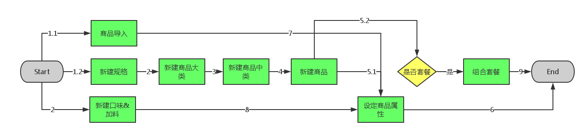

# 商品管理

## 功能说明

商品管理菜单主要提供用户对商品的规格、类别、属性等相关功能进行设定。

## 功能明细
* [商品规格](chapter2.1.md)
* [商品大类](chapter2.2.md)
* [商品中类](chapter2.3.md)
* [商品资讯](chapter2.4.md)
* [口味](chapter2.5.md)
* [加料](chapter2.6.md)
* [商品属性设定](chapter2.7.md)
* [套餐](chapter2.8.md)
* [商品导入](chapter2.9.md)