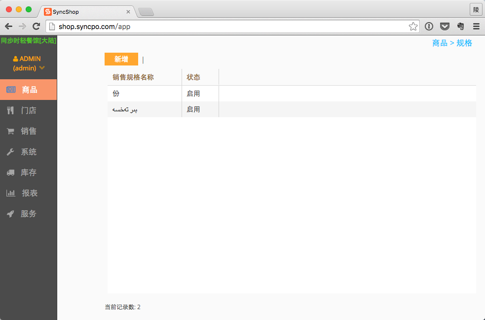

# 商品规格

## 功能说明
当同一个商品存在多个相似的品项时，可以将这多个商品按同样的商品命名，并用规格做区分，既方便点单时根据客户的需要进行快速切换和价格调整，也方便后期汇总销售数据，进行统一的分析。

常见的规格应用场景，如：
  * 同一碗面条分：大、中、小碗三个规格；
  * 一杯饮料有M、L两个杯型。

## 操作说明

1. 点击商品管理界面中的【规格】功能，进入规格设定界面；

2. 列表中显示“销售规格名称”、“状态”两个栏位

  销售规格名称：设定规格时，所填写的规格名称，该名称为命名不可重复；

  状态：显示当前规格的使用状态，分为【启用】、【禁用】两种状态，可以变更；

3. 新增规格

  1. 首先，点击界面上的【新增】按键，系统弹出规格新增信息界面

  2. 在【销售规格名称】栏位输入所要新增的规格名称；可在【第二语言】栏位录入所要显示的第二语言名称；

  3. 点击【保存】按键，对新设定的信息进行保存作业；

  4. 点击【继续新增】按键，可在保存当前新增信息后，对新增界面进行清空；操作人员可继续新增新的规格；

  5. 点击【取消】按键，取消当前的新增操作，并退出到规格设定界面；

4. 编辑

  1. 首先，在规格设定界面，点击规格列表中的需编辑的规格栏位，系统弹出规格编辑及状态修改界面 
  2. 点击【编辑】按键，可对规格进行重新编辑；编辑完成后，点击【保存】，对编辑后的名称进行保存作业；点击【取消】，放弃当前的编辑作业，返回至规格列表界面；

5. 状态修改

  1. 首先，在规格设定界面，点击规格列表中的需编辑的规格栏位，系统弹出规格编辑及状态修改界面；
  2. 状态分为【停用】、【启用】两种；
  3. 当界面中的按键为【启用】时，说明该规格为【停用】状态，操作人员点击【启用】按键后，对该规格进行启用作业；
  4. 当界面中的按键为【停用】时，说明该规格为【启用】状态，操作人员点击【停用】按键后，对该规格进行停用作业；
  5. 当该规格被商品使用时，规格无法被停用；

